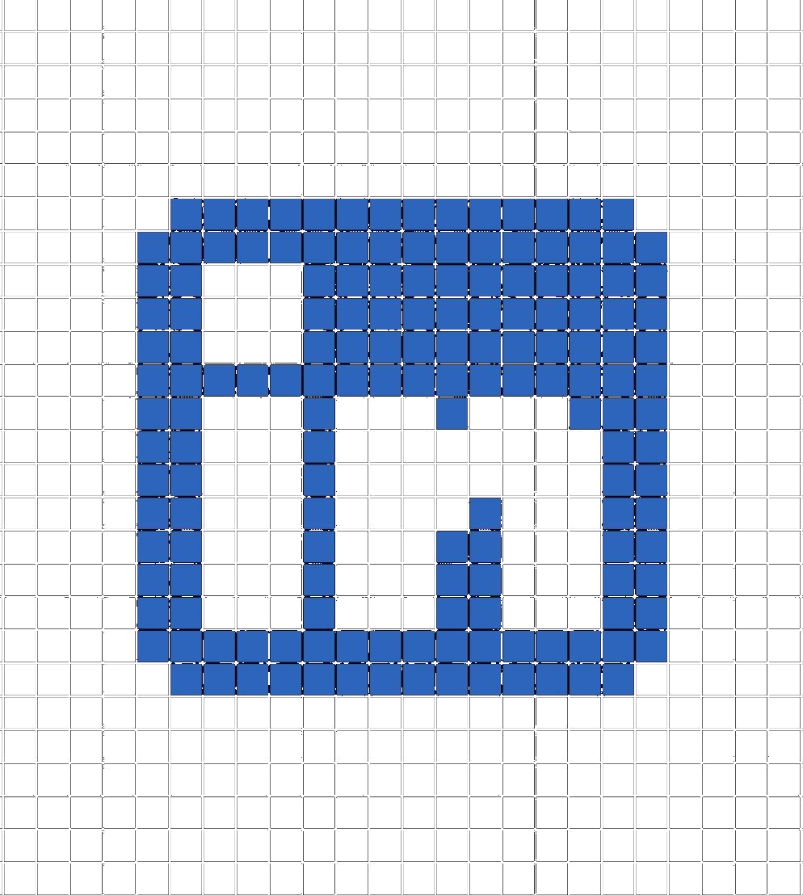
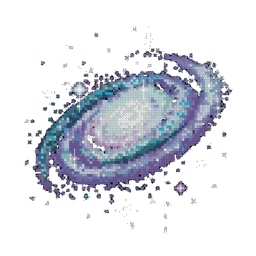

  <h3>Welcome to [YOUR_NAME]'s GitHub </></h3>
  
  

    
    &nbsp;&nbsp;
    
  

---

###  About me 

<table>
  <tr>
    <td width="60%">
      Hello There! I'm <b>[YOUR_NAME]</b>, a Systems Engineer student. I enjoy learning new technologies and problem solving. Now I'm working on some projects to put in practice my knowledge about JavaScript, React, and more.
        
      🏛️ Studying at <b>[YOUR_UNIVERSITY]</b> 
        </td>
    <td width="40%" align="center">
      
    </td>
  </tr>
</table>

---

### ⚙️ Technologies 

  

