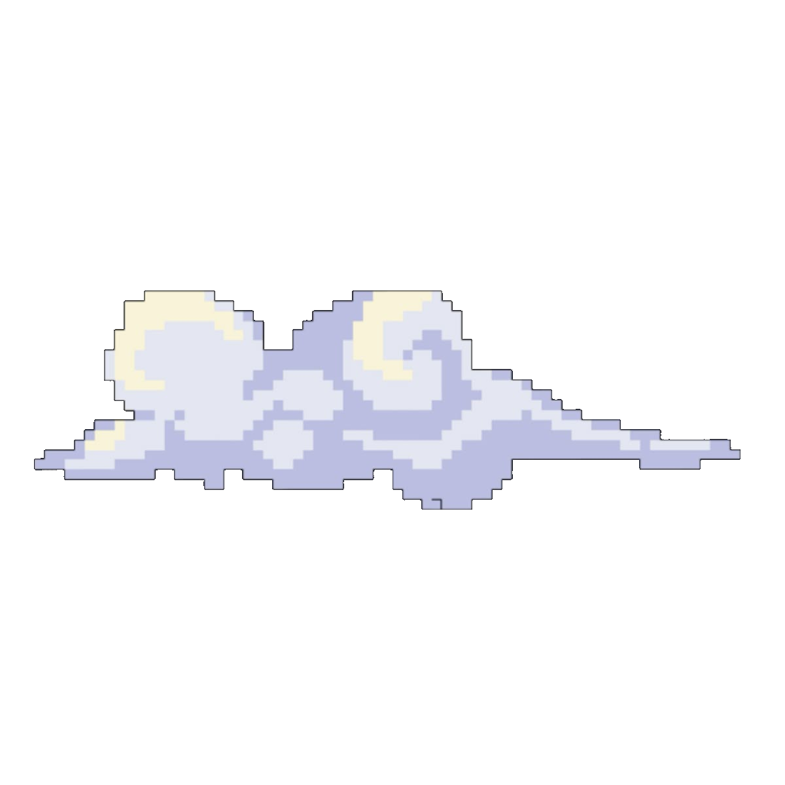

   
  
  

    
    <a href="https://personal-linktree-l6lr.vercel.app">
      <b>🔗 MY Social Accounts</b>
    </a>
    
  

---

### &nbsp;About me 

<table border="0">
  <tr>
    <td width="60%" style="border: none;">
      Hello There!  I'm <b>Aya</b>, a computer science student. I enjoy learning new technologies and problem solving. Now I'm working on some projects to put in practice my knowledge about JavaScript, React, and more.
        
      🏛️ Studying at <b>Estin</b>     
    </td>
    <td width="40%" align="center" style="border: none;">
      
    </td>
  </tr>
</table>

---

###  ⚙️ Technologies 

  

  

 

  
  

